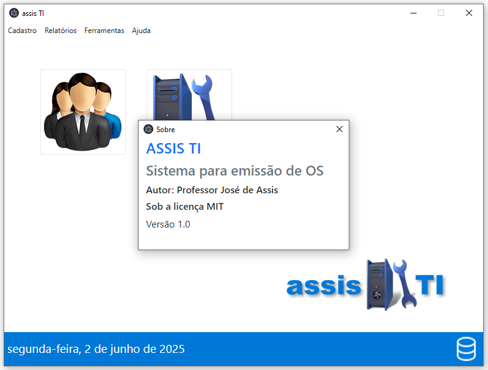
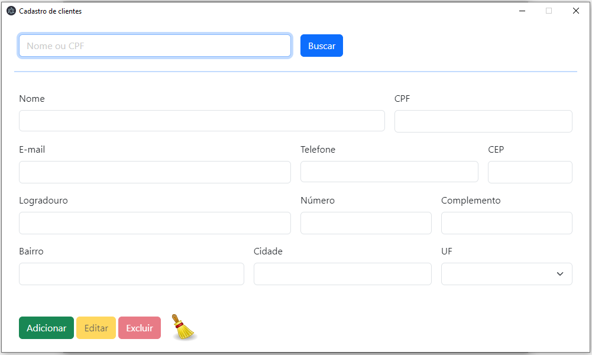
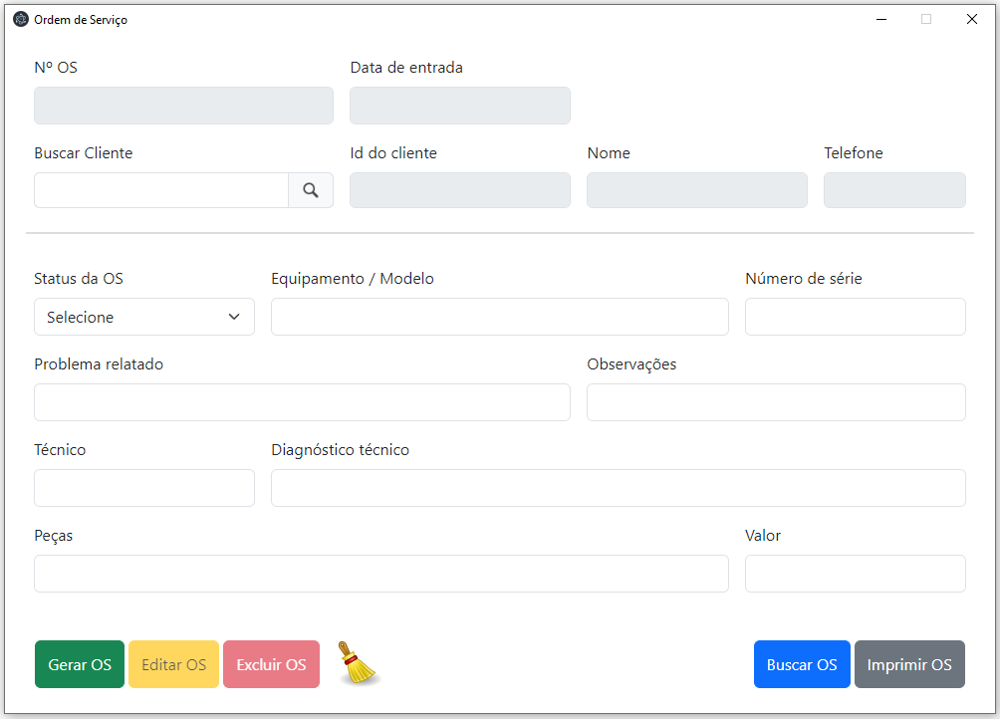
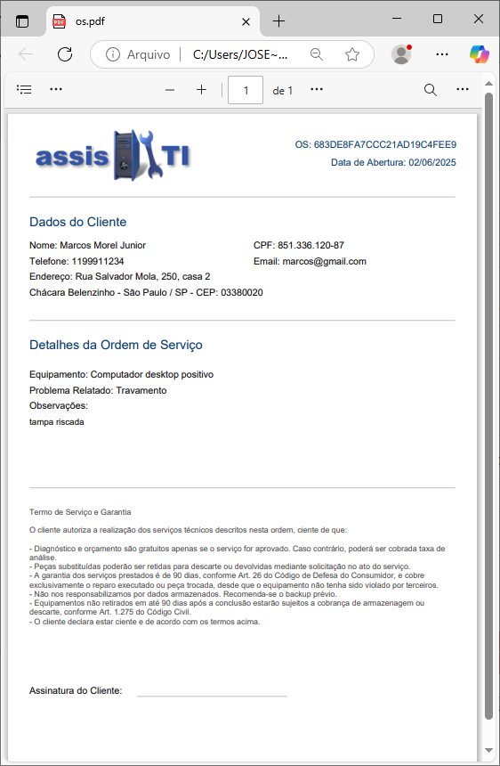
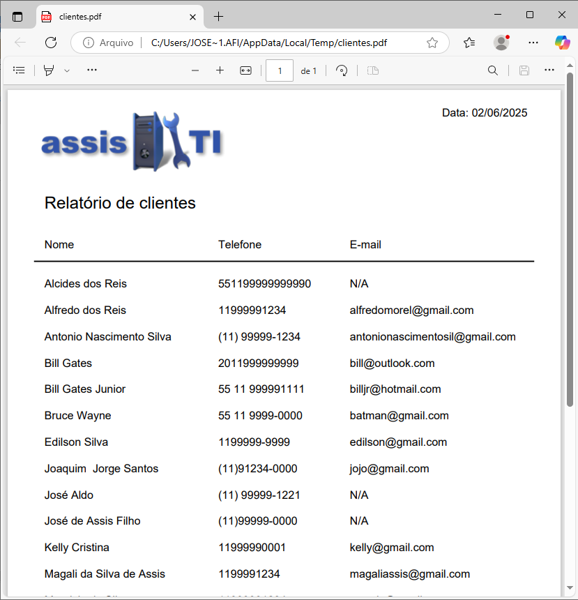
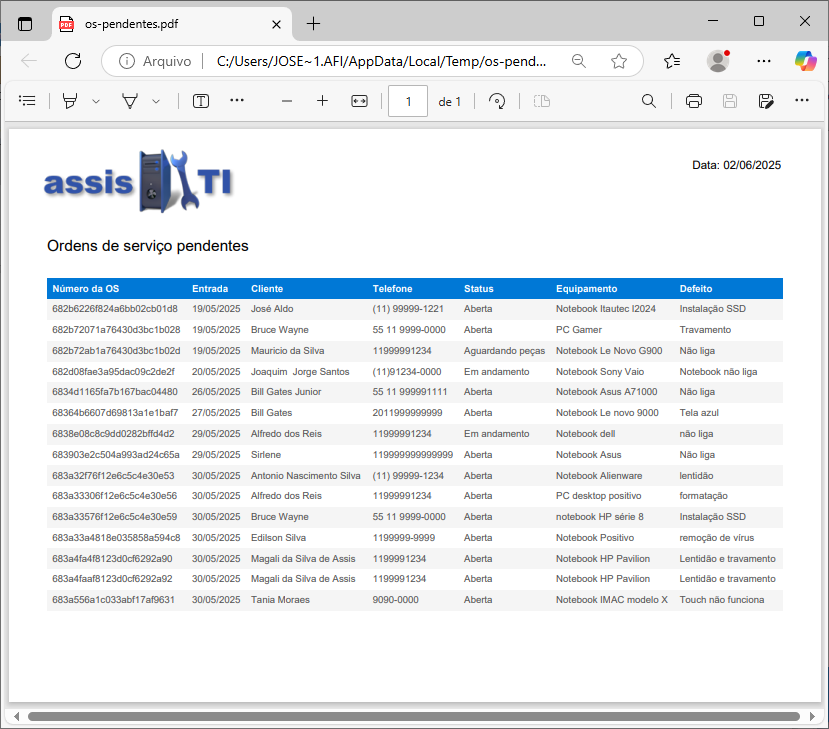
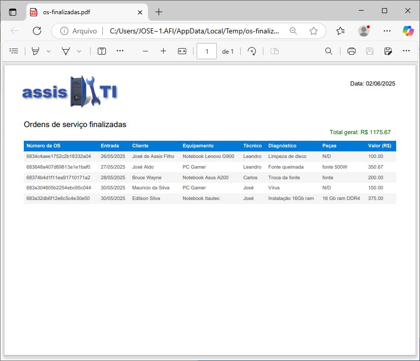

# assis 🖥️ TI
Sistema para gestão de serviços de uma assistência técnica de computadores e notebooks desenvolvido com uso do framework Electron e do banco de dados MongoDB.
### Tela principal

### Cadastro de clientes

### Ordem de serviço

### Relatório de clientes

### Relatório OS Pendentes

### Relatório OS Finalizadas

## Autor
Professor José de Assis 
## Pré-requisitos de instalação:
- Windows 10 ou superior
- Ter o banco de dados MongoDB instalado
### Instalação do MongoDB:
Acesse o site oficial:
[MongoDB](https://www.mongodb.com/try/download/community)

Baixe o MongoDB Community Server e instale com a opção de "Install MongoDB as a Service" ativada (instalação padrão).

Após instalar, ele inicia automaticamente.

### Instalação do sistema assisTI
Em releases faça o download da última versão (.exe) disponibilizada e execute no computador.

### ☕ Projetos sem café? Impossível!
Criar e compartilhar projetos gratuitos exige tempo, dedicação e, claro, muito café! Se quiser apoiar, um "cafezinho" faz toda a diferença.  Sua doação incentiva mais projetos reais e mantém a motivação lá em cima!
#### Chave PIX❖:
~~~txt
josedeassisfilho@gmail.com
~~~
*( em nome de José de Assis Filho )*

E olha, só de dar uma estrela ⭐, seguir o repositório e compartilhar, você já está dando uma baita força!

😃 Valeu demais pelo apoio!
